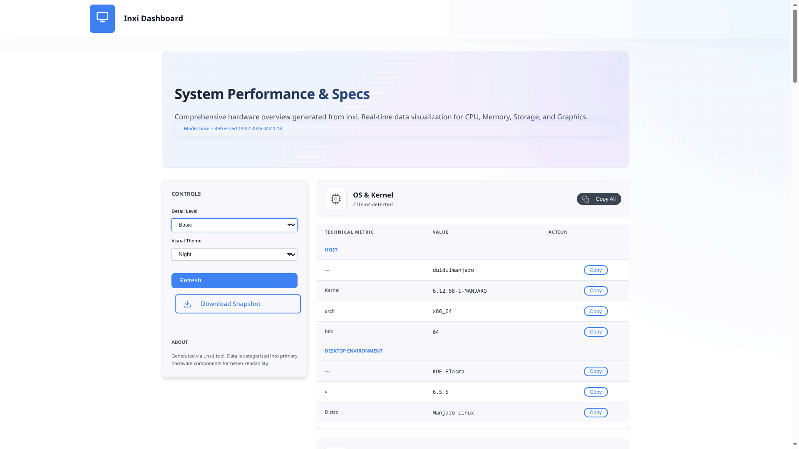
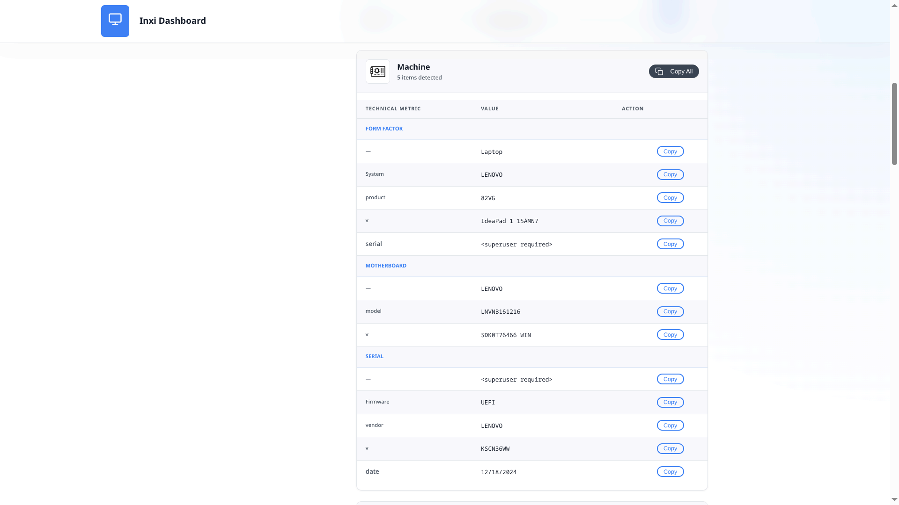
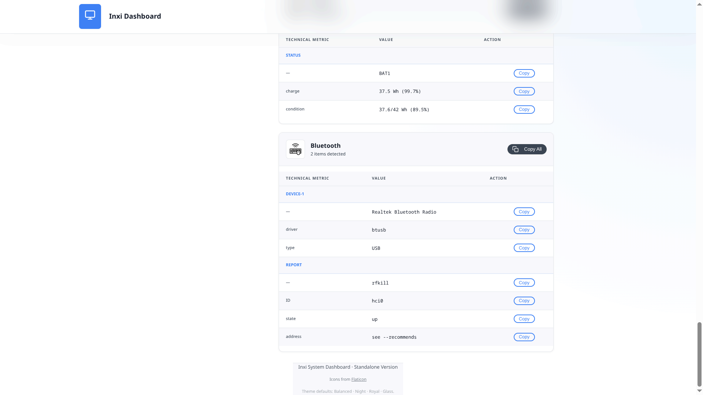
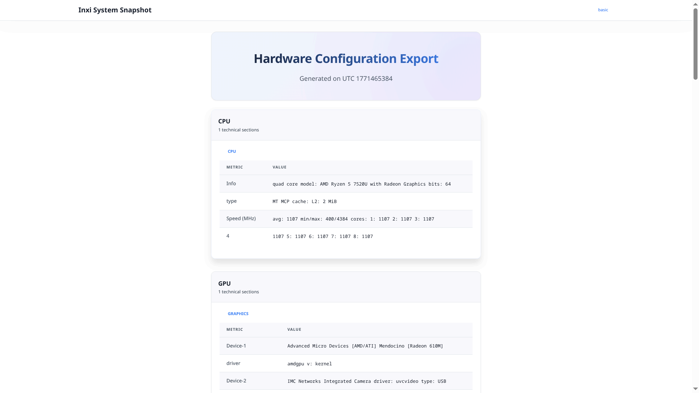

# Inxi Dash

Modern, production-ready Linux system dashboard powered by `inxi`.

Inxi Dash transforms raw `inxi` output into a structured JSON API and a clean web-based dashboard with dark/light theme support — fully self-contained and deployable as a single binary.

---

## ✨ Features

- 🔎 Full system inspection via `inxi`
- 📊 Structured JSON API
- 🖥 Web dashboard (localhost:3050)
- 🌗 Dark / Light theme toggle
- 📦 Fully embedded static assets (build.rs powered)
- 📄 Standalone HTML export
- 🧩 Clean modular Rust architecture
- 🛡 Secure command execution (no injection)
- 🧱 Extensible service layer

---

## 📸 Screenshots






---

## 📦 Requirements

- Linux
- Rust (stable)
- `inxi` installed and available in PATH

Install inxi (Debian/Ubuntu):

```bash
sudo apt install inxi
````

---

## 🚀 Running

```bash
cargo build --release
./target/release/inxi-dash
```

Open:

```
http://127.0.0.1:3050
```

---

## 🔌 API Usage

### Get system info

```bash
curl "http://127.0.0.1:3050/api/system?mode=maximum"
```

Supported modes:

| Mode    | Description            |
| ------- | ---------------------- |
| basic   | Standard overview      |
| full    | Extended output        |
| verbose | Detailed hardware info |
| maximum | Maximum verbosity      |

---

## 📄 Export Report

Download standalone HTML report:

```
http://127.0.0.1:3050/download?mode=maximum
```

---

## 🏗 Architecture

* Axum-based HTTP server
* Service layer abstraction
* ANSI stripping and structured parsing
* build.rs static asset embedding
* Typed JSON models (serde)
* Structured error handling

---

## 🔐 Security Design

* Strict internal argument mapping
* No shell invocation
* No dynamic file serving
* Embedded static assets only
* Structured error responses

---

## 🧭 Roadmap

* WebSocket live monitoring
* Historical system snapshots
* Docker image
* Plugin-based provider system
* REST API versioning

---

## 🛠 Credits

- [Melt UI](https://github.com/aiedrow/Melt) - UI framework and styling.

---

## 📜 License

MIT
